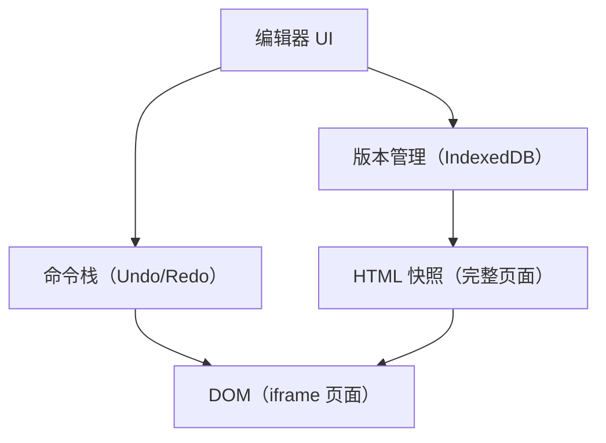

# Coze PPT 在线编辑器技术实现方案（精简版）

## 一、项目概述

本文档基于对 Coze 网站 PPT 在线编辑器的源码分析，详细阐述其技术架构和实现方案。该编辑器用于对 AI 生成的 HTML PPT 进行在线编辑，支持实时预览和图表编辑。

## 二、核心技术架构

### 2.1 技术栈

- **前端框架**：React 18.x
- **样式框架**：Tailwind CSS 3.x
- **状态管理**：Zustand（轻量级状态管理）
- **图表引擎**：Chart.js 3.x + ECharts 5.x（双引擎支持）
- **图标库**：Font Awesome
- **通信机制**：PostMessage API（跨域通信）
- **监控系统**：Slardar（性能和错误监控）

### 2.2 整体架构设计

#### 2.2.1 架构分层

```
┌─────────────────────────────────────────────────────────┐
│                   主应用层 (React)                       │
│  ┌──────────────┐  ┌──────────────┐  ┌──────────────┐  │
│  │ 工具栏组件   │  │ 侧边栏组件   │  │ 属性面板     │  │
│  └──────────────┘  └──────────────┘  └──────────────┘  │
│  ┌───────────────────────────────────────────────────┐  │
│  │            预览区域 (Preview Container)            │  │
│  │  ┌─────────────────────────────────────────────┐  │  │
│  │  │  iframe 1 (PPT Page 1)                      │  │  │
│  │  │   - HTML Content (srcdoc)                   │  │  │
│  │  │   - Chart.js/ECharts Proxy Scripts          │  │  │
│  │  │   - 独立的 CSS/JS 执行环境                   │  │  │
│  │  └─────────────────────────────────────────────┘  │  │
│  │  ┌─────────────────────────────────────────────┐  │  │
│  │  │  iframe 2 (PPT Page 2)                      │  │  │
│  │  │   - 选中框层通过 Portal 渲染在 iframe.body   │  │  │
│  │  └─────────────────────────────────────────────┘  │  │
│  │  ...                                              │  │
│  └───────────────────────────────────────────────────┘  │
└─────────────────────────────────────────────────────────┘
                    ↕ PostMessage 通信
```

#### 2.2.2 核心架构特点

**1. 隔离渲染架构**

- 每个 PPT 页面运行在独立的 iframe 中
- 使用 `srcdoc` 属性直接注入完整 HTML 内容
- 完全的样式隔离和脚本隔离
- 避免不同页面间的 CSS/JS 冲突

**2. 单层渲染 + 主应用控制架构**

- **iframe 层**：PPT 内容渲染、事件监听、选中框渲染（通过 React Portal）
- **主应用层**：编辑器 UI（工具栏、属性面板）、状态管理、编辑逻辑
- 选中框使用 `createPortal` 渲染到 iframe.body 中，避免跨层坐标转换问题

**3. 代理注入架构**

- 在 iframe 加载前注入图表库代理脚本
- 拦截 Chart.js 和 ECharts 的初始化方法
- 实现图表数据的持久化和编辑

**4. 事件通信架构**

- PostMessage 实现父子窗口通信
- 安全密钥验证机制
- 支持图表更新、高度同步、编辑器状态同步

### 2.3 核心设计模式

#### 2.3.1 代理模式 (Proxy Pattern)

用于图表编辑功能，拦截图表库的初始化和更新方法：

```
图表初始化 → 代理拦截 → 数据存储 → 原始方法调用
     ↑                                      ↓
     └────────── 用户编辑更新 ←──────────────┘
```

**核心机制**：

- 使用全局对象 `UPDATED_DATA_MAP` 存储图表配置
- 拦截 `Chart.js` 构造函数和 `ECharts.setOption` 方法
- 编辑后的数据优先于原始配置被应用

#### 2.3.2 观察者模式 (Observer Pattern)

用于状态管理和组件通信：

- Zustand 状态管理器订阅机制
- 元素选中状态的全局共享
- 拖拽、缩放等操作的实时同步

#### 2.3.3 命令模式 (Command Pattern)

用于撤销/重做功能：

- 每个编辑操作封装为独立的命令对象
- 包含 `redo()` 和 `undo()` 方法
- 操作历史栈管理（最多保存 50 条）

### 2.4 数据流向

#### 2.4.1 页面渲染流程

```
HTML 数据 → 注入代理脚本 → srcdoc 渲染 → DOMContentLoaded
    → PostMessage 报告高度 → 父窗口调整容器 → 渲染完成
```

#### 2.4.2 元素编辑流程

```
iframe 内点击事件 → 元素类型识别 → 坐标转换 → 主应用绘制选中框
    → 拖拽/缩放操作 → 计算新样式 → 更新 iframe 内元素 → 刷新选中框
```

#### 2.4.3 图表编辑流程

```
点击图表元素 → 打开编辑对话框 → 用户修改数据 → PostMessage 发送
    → iframe 接收更新 → UPDATED_DATA_MAP 存储 → 图表重新渲染
```

### 2.5 关键技术决策

#### 2.5.1 为什么使用 iframe？

**优势**：

- ✅ 完全的样式和脚本隔离
- ✅ 支持多页面独立渲染
- ✅ 便于实现预览和编辑分离
- ✅ 安全沙箱环境

**挑战及解决**：

- ❌ 跨域通信限制 → ✅ PostMessage + 密钥验证
- ❌ 坐标系不一致 → ✅ 缩放比例转换
- ❌ 事件传递复杂 → ✅ 事件委托和冒泡控制

#### 2.5.2 为什么使用代理模式？

**核心需求**：在不修改图表库源码的情况下，实现图表编辑后的持久化

**方案对比**：

- ❌ 重新渲染整个 iframe → 性能差，状态丢失
- ❌ 直接修改 DOM → 图表库内部状态不一致
- ✅ 代理模式 → 无缝集成，数据持久化

#### 2.5.3 为什么使用 transform: scale()？

**响应式适配方案对比**：

- ❌ 固定尺寸 → 不支持响应式
- ❌ 百分比布局 → PPT 尺寸固定，难以适配
- ❌ 媒体查询 → 需要多套样式，维护成本高
- ✅ CSS Transform 缩放 → 简单高效，保持原始布局

### 2.6 性能优化策略

#### 2.6.1 渲染优化

- **延迟加载**：使用 `loading="lazy"` 延迟加载 iframe
- **虚拟滚动**：大量页面时只渲染可视区域
- **防抖节流**：拖拽、缩放操作使用节流优化

#### 2.6.2 内存优化

- **操作历史限制**：最多保存 50 条撤销记录
- **事件监听清理**：组件卸载时移除所有监听器
- **iframe 复用**：切换页面时复用 iframe 实例

#### 2.6.3 通信优化

- **消息批处理**：合并多个 PostMessage 请求
- **数据压缩**：大型图表数据使用 JSON 压缩
- **密钥缓存**：避免重复验证

## 三、关键技术实现

### 3.1 PPT 页面渲染机制

#### 3.1.1 iframe + srcdoc 方案

每个 PPT 页面使用独立的 iframe 渲染，通过 `srcdoc` 属性直接注入 HTML 内容。

**核心代码**：

```html
<iframe
  width="1280"
  height="720"
  loading="lazy"
  style="transform: scale(0.620313); transform-origin: left top;"
  srcdoc="<!DOCTYPE html><html>...</html>"
></iframe>
```

**优势**：

- 完全的样式隔离，避免 CSS 冲突
- 独立的 JavaScript 执行环境
- 支持延迟加载（`loading="lazy"`）

#### 3.1.2 响应式适配方案

**宽度适配**：CSS Transform 缩放

使用 `transform: scale()` 让固定尺寸的 PPT (1280x720) 适应不同宽度的容器：

```javascript
const scale = containerWidth / 1280;
iframe.style.transform = `scale(${scale})`;
iframe.style.transformOrigin = "left top";
```

**高度同步**：PostMessage 通信

iframe 内部向父窗口报告实际高度，父窗口根据缩放比例调整容器。

```javascript
// iframe 发送高度
window.parent.postMessage(
  {
    type: "initHeight",
    height: document.body.scrollHeight,
    key: SECURITY_KEY,
  },
  "*"
);

// 父窗口接收并调整
const scaledHeight = height * currentScale;
iframe.parentElement.style.height = scaledHeight + "px";
```

**协作机制**：宽度通过缩放，高度通过 PostMessage 同步。

### 3.2 元素选中与编辑架构

#### 3.2.1 可编辑元素类型

Coze 定义了四种可编辑元素类型：

| 类型  | 说明     | 识别方式                     |
| ----- | -------- | ---------------------------- |
| Text  | 文本元素 | 包含文本节点                 |
| Image | 图片元素 | `` 标签或背景图片       |
| Block | 区块元素 | 其他可见容器元素             |
| Chart | 图表元素 | 带 `he_chart_container` 标记 |

**元素识别逻辑**：

```javascript
function getEditableType(element) {
  // 1. 优先检查 nodeInfo 标记
  if (element.nodeInfo?.editType) return element.nodeInfo.editType;

  // 2. 通过特征判断
  if (element.dataset?.he_chart_container) return "chart";
  if (element.tagName === "IMG") return "image";
  if (hasTextContent(element)) return "text";
  if (hasVisibleContent(element)) return "block";

  return null;
}
```

#### 3.2.2 元素选中机制

**选中流程**：

```
iframe 点击 → 类型识别 → 坐标转换 → 主应用绘制选中框
```

**核心实现**：

- 监听 iframe 内的 `mousedown` 事件
- 向上查找最近的可编辑元素
- 计算元素在 iframe 中的位置（`getBoundingClientRect()`）
- 使用 `createPortal(SelectionBox, iframeDoc.body)` 将选中框渲染到 iframe 内部
- 选中框与内容元素在同一坐标系中，无需坐标转换

#### 3.2.3 选中框结构

选中框包含多个交互手柄：

- **拖拽手柄**：显示元素类型，支持拖拽移动
- **8 个缩放手柄**：四个角（`tl`, `tr`, `bl`, `br`）+ 四条边中点（`tc`, `bc`, `lc`, `rc`）
- **边线拖拽手柄**：四条边线（`t`, `b`, `l`, `r`）支持拖拽移动

**缩放补偿**：由于 iframe 使用 `transform: scale()` 缩放，手柄也会被缩放。使用 `scale(1/scale)` 反向缩放保持手柄大小不变。

### 3.3 元素拖拽与缩放

#### 3.3.1 拖拽实现

**核心机制**：

1. **门槛设置**：移动超过 3px 且超过 100ms 才触发拖拽
2. **状态跟踪**：记录 `startTime`、`startX/Y`、`hasMoved`、`dragStarted`
3. **坐标转换**：将主应用坐标转换为 iframe 坐标：`iframeX = (mainX - iframeLeft) / scale`
4. **快速点击**：< 200ms 且未移动的点击用于选择子元素

#### 3.3.2 缩放实现

**关键要点**：

- 根据手柄位置计算新尺寸（对角手柄同时调整宽高）
- 考虑缩放比例进行坐标转换
- 实时更新 iframe 内元素的样式（`width`、`height`、`transform`）
- 同步更新选中框位置

### 3.4 元素编辑实现

#### 3.4.1 文本编辑

**编辑模式**：

- 双击进入编辑模式
- 设置 `contentEditable = true`
- 使用 `selectionchange` 事件监听文本选择
- 失焦时保存编辑结果

#### 3.4.2 图表编辑

**编辑流程**：

```
点击图表 → 打开编辑对话框 → 用户修改数据 → PostMessage 发送
  → iframe 接收 → UPDATED_DATA_MAP 存储 → 图表重新渲染
```

#### 3.4.3 部分文本样式修改核心算法

设计目标：在同一段文本内支持“局部加粗 / 颜色 / 斜体”等样式叠加，且撤销/重做可恢复到操作前状态。

核心流程：

1. 监听 `selectionchange`，读取 `document.getSelection()` 与 `Range`
2. 遍历选区内的所有文本节点（TreeWalker 只取 TEXT_NODE）
3. 计算每个文本节点相对选区的开始/结束偏移
4. 判断是“整节点选中”还是“部分选中”
5. 整节点选中：直接改父元素的 style，并记录原始值到 `changedStyles`
6. 部分选中：按偏移把 TextNode 分割，选中段用 `<span style="...">` 包裹，收集到 `wrappedSpans`
7. 尝试恢复选区（跨节点情况下，按选中文本内容 + 公共祖先恢复）
8. 刷新 iframe 预览（重绘选中框等）

关键函数（精简伪代码）：

```javascript
// 获取选区内所有文本节点
function getTextNodesInRange(doc, range) {
  const walker = doc.createTreeWalker(range.commonAncestorContainer, NodeFilter.SHOW_TEXT, {
    acceptNode(node) {
      const nodeRange = doc.createRange();
      nodeRange.selectNodeContents(node);
      return range.intersectsNode(node) ? NodeFilter.FILTER_ACCEPT : NodeFilter.FILTER_REJECT;
    },
  });
  const nodes = [];
  while (walker.nextNode()) nodes.push(walker.currentNode);
  return nodes;
}

// 计算当前文本节点与选区的相对偏移
function calculateTextNodeOffsets(textNode, range) {
  const nodeRange = textNode.ownerDocument.createRange();
  nodeRange.selectNodeContents(textNode);
  const start = Math.max(0, range.startContainer === textNode ? range.startOffset : 0);
  const end = Math.min(textNode.length, range.endContainer === textNode ? range.endOffset : textNode.length);
  return { startOffset: start, endOffset: end };
}

function isWholeTextNode(textNode, startOffset, endOffset) {
  return startOffset === 0 && endOffset === (textNode.textContent?.length || 0);
}

// 按偏移分割并包裹选中段
function splitAndWrapTextNode(doc, textNode, startOffset, endOffset, styleKey, styleValue, wrappedSpans) {
  const text = textNode.textContent || "";
  const before = text.slice(0, startOffset);
  const selected = text.slice(startOffset, endOffset);
  const after = text.slice(endOffset);

  const frag = doc.createDocumentFragment();
  if (before) frag.appendChild(doc.createTextNode(before));
  if (selected) {
    const span = doc.createElement("span");
    span.style[styleKey] = styleValue;
    span.appendChild(doc.createTextNode(selected));
    frag.appendChild(span);
    wrappedSpans.push(span);
  }
  if (after) frag.appendChild(doc.createTextNode(after));
  textNode.parentElement?.replaceChild(frag, textNode);
}

// 应用样式到当前选区（整节点优先，部分节点走分割包裹）
function applyStyleToSelection(doc, styleKey, styleValue, changedStyles, wrappedSpans) {
  const sel = doc.defaultView?.getSelection();
  if (!sel || !sel.rangeCount) return;
  const range = sel.getRangeAt(0);
  const textNodes = getTextNodesInRange(doc, range);

  textNodes.forEach((node) => {
    const { startOffset, endOffset } = calculateTextNodeOffsets(node, range);
    if (startOffset === endOffset) return; // 空选区

    const parentEl = node.parentElement;
    if (parentEl && isWholeTextNode(node, startOffset, endOffset)) {
      changedStyles.push({ element: parentEl, key: styleKey, originalStyle: parentEl.style[styleKey] });
      parentEl.style[styleKey] = styleValue;
    } else {
      splitAndWrapTextNode(doc, node, startOffset, endOffset, styleKey, styleValue, wrappedSpans);
    }
  });
}

// 尝试恢复选区（跨节点时按选中文本 + 祖先容器定位）
function restoreSelection(selection, selectedText, ancestor) {
  try {
    if (!selection || !selectedText || !ancestor) return;
    const range = ancestor.ownerDocument.createRange();
    // 真实实现会在 ancestor 内查找 selectedText 的起止位置，这里略
    selection.removeAllRanges();
    selection.addRange(range);
  } catch (err) {
    console.warn("Failed to restore selection:", err);
  }
}
```

边界与细节：

- 零宽字符（U+200B）作为光标占位，用于空选区或需要恢复插入点的场景
- 跨节点选择：按文本片段对齐，避免误选到不可编辑区域
- 样式叠加：局部 `<span>` 与父元素 style 并存，撤销时按记录精确回滚

示例（“美团财报”）：

```html
<!-- 操作 1：选中“美团财”→ 加粗 -->
<div><span style="font-weight: bold">美团财</span>报</div>

<!-- 操作 2：选中“财报”→ 颜色 red -->
<div>
  <span style="font-weight: bold">美团</span>
  <span style="font-weight: bold; color: red">财</span>
  <span style="color: red">报</span>
</div>

<!-- 操作 3：选中“团财”→ 斜体 italic -->
<div>
  <span style="font-weight: bold">美</span>
  <span style="font-weight: bold; font-style: italic">团</span>
  <span style="font-weight: bold; color: red; font-style: italic">财</span>
  <span style="color: red">报</span>
</div>
```

### 3.5 操作历史、撤销与重做机制

Coze 的在线 PPT 编辑器在历史记录、撤销、重做上，采用了典型的“命令模式 + 历史栈管理”方案，并且把所有编辑操作（文本样式、元素移动、图表修改等）统一封装为可撤销的命令对象。

#### 3.5.1 核心设计：命令模式 + 历史栈

1. 每一次用户编辑操作都会被包装成一个“命令对象”

   - 命令对象至少包含两个方法：`redo()` 和 `undo()`
   - `redo()`：执行本次编辑（应用样式、移动元素、更新图表等）
   - `undo()`：撤销本次编辑（恢复原始样式、还原位置、还原图表配置等）

2. 编辑器维护一个“操作历史管理器”（Action Manager）

   - 内部可以理解为两个栈：
     - 撤销栈（Undo 栈）：记录已经执行的命令
     - 重做栈（Redo 栈）：记录被撤销的命令
   - 每次执行新操作：
     - 把命令压入撤销栈
     - 清空重做栈（因为历史分叉）

3. 与全局 Store 的集成

在 `index.260aada0.js` 中，可以看到一个全局的 HTML Render Store（Zustand store）对外暴露了统一的历史接口：

```javascript
// 伪代码化的精简结构
const useHtmlRenderStore = create((set, get) => ({
  // ... 其他状态
  undoStore: createUndoStore(), // 专门管理历史记录的子 store
  events: { undo: [], redo: [] },

  // 供外部调用的接口
  addChange: (actionMessage) => {
    // 所有需要进入历史的操作，最终都会调用这里
    get().undoStore.getState().addUndoItem(actionMessage);
  },

  undo: () => {
    // 先广播“undo”事件（用于刷新 UI 等）
    get().events.undo?.forEach((listener) => listener({ type: "undo" }));
    // 再真正执行 undo 栈中的命令
    get().undoStore.getState().undo();
  },

  redo: () => {
    get().events.redo?.forEach((listener) => listener({ type: "redo" }));
    get().undoStore.getState().redo();
  },
}));
```

- `addChange`：对外的统一入口，所有可撤销的操作都通过它记录到 `undoStore`
- `undo()` / `redo()`：由工具栏快捷键、按钮等触发，最终调用 `undoStore` 的对应方法

虽然源码中 `undoStore` 的具体实现被打包混淆，但从调用方式可以推断：

- 内部维护一个有上限的历史数组（文档中提到“最多 50 条”）
- 每条历史项都包含一个或多个命令对象，用于支持“组合操作一次撤销”

#### 3.5.2 文本样式编辑的历史记录

对于“部分文本加粗/变色/斜体”这类复杂操作，命令对象会非常细致地记录修改前后的状态。对应代码在 `6189.6ea23f61.js` 的文本样式修改逻辑中（章节 4.3 已分析），核心是一个带有 `redo` 和 `undo` 的操作对象：

```javascript
// 精简后的结构
function createTextStyleAction(payload, ctx) {
  const { value } = payload; // 本次要应用的样式，如 { fontWeight: 'bold', color: '#f00' }
  const { document } = ctx;

  const changedStyles = []; // 记录直接修改过 style 的 DOM 元素
  const wrappedSpans = []; // 记录为部分文本新创建的 <span> 包裹节点
  const range = getSelectionRange(document); // 当前选区 Range
  const selectedText = range?.toString(); // 选中的文本

  return {
    // redo：应用样式
    redo: () => {
      Object.entries(value).forEach(([styleKey, styleValue]) => {
        if (!styleValue) return;
        // 针对当前选区，遍历涉及到的文本节点和元素
        applyStyleToSelection(document, styleKey, styleValue, changedStyles, wrappedSpans);
      });
      return refreshIframe(ctx); // 刷新 iframe 预览
    },

    // undo：撤销样式
    undo: () => {
      // 1. 还原直接修改过 style 的元素
      changedStyles.forEach(({ element, key, originalStyle }) => {
        element.style[key] = originalStyle;
      });

      // 2. 拆除为了部分文本创建的 <span> 包裹
      wrappedSpans.forEach((span) => {
        const frag = document.createDocumentFragment();
        Array.from(span.childNodes).forEach((child) => frag.appendChild(child));
        span.replaceWith(frag);
      });

      // 3. 尝试恢复光标/选区位置
      if (range && selectedText) {
        restoreSelection(document.defaultView?.getSelection(), selectedText, range.commonAncestorContainer);
      }

      return refreshIframe(ctx);
    },
  };
}
```

特点：

- `redo()`：
  - 对整个选区进行扫描
  - 能直接加样式的元素记录在 `changedStyles` 中
  - 对于“只选中了部分文本”的情况，通过拆分文本节点 + 新建 `<span>` 包裹来实现局部样式
- `undo()`：
  - 逐一恢复原始样式值
  - 把新建的 `<span>` 打散回普通文本节点
  - 尝试恢复用户的文本选区（通过选中文本内容 + Range 定位）

当用户在文本工具栏点击“加粗/变色”等操作时：

1. 由 UI 层构造 `payload`（要应用的样式）
2. 调用 `createTextStyleAction(payload, ctx)` 生成命令对象
3. 把命令对象交给 `actionManager/undoStore` 执行并入栈

#### 3.5.3 元素拖拽与缩放的历史记录

在元素拖拽逻辑（`index.260aada0.js` 中的拖拽 hook）中，可以看到拖拽结束时，会把“拖拽前后的 transform 值”包装成一个命令对象，交给 `actionManager` 管理：

```javascript
// 精简后的拖拽逻辑片段
function useElementDrag({ boxRef, onSnap, onChange }) {
  const { iframeDoc, selectedElement, isDragging, setIsDragging, actionManager } = useRenderStore();

  const dragStateRef = useRef({
    // 记录拖拽开始时的状态
    bodyStartCursor: "unset",
    mouseStartX: 0,
    mouseStartY: 0,
    elementStartX: 0,
    elementStartY: 0,
    elementStartTX: 0,
    elementStartTY: 0,
    elementStartTSX: 1,
    elementStartTSY: 1,
    styleChange: "", // 拖拽过程中实时计算出来的 transform
    dragging: false,
    originStyle: "", // 拖拽前元素的 transform 原始值
  });

  // 鼠标抬起，结束拖拽
  const handleMouseUp = () => {
    dragStateRef.current.dragging = false;
    // ... 移除事件监听、恢复光标等

    if (isDragging && dragStateRef.current.styleChange && actionManager && selectedElementRef.current) {
      // 触发外部回调（用于刷新 UI、同步状态）
      onChange("move");

      // 使用命令模式记录本次拖拽
      actionManager.execute(
        new MoveElementTransformAction({
          elementId: getElementId(selectedElementRef.current),
          oldValue: { transform: dragStateRef.current.originStyle },
          value: { transform: dragStateRef.current.styleChange },
        })
      );
    }
  };

  return { handleMouseDown };
}
```

可以推断：

- `MoveElementTransformAction` 是一个命令类，内部同样实现了 `redo()` 和 `undo()`：
  - `redo()`：把元素的 `style.transform` 设为新的 transform（拖拽后位置）
  - `undo()`：把 `style.transform` 还原为 `oldValue.transform`（拖拽前）
- `actionManager.execute(...)` 会：
  1. 调用命令的 `redo()` 真正修改 DOM
  2. 把命令推入历史栈，供后续撤销/重做使用

拖拽缩放的历史记录特点：

- 每一次鼠标释放（一次完整拖拽）只记录一条历史
- 拖拽过程中不会反复入栈，避免历史膨胀

#### 3.5.4 图表编辑的历史记录

图表编辑采用相同的命令机制。在 `6189.6ea23f61.js` 中，图表编辑逻辑通过一个图表编辑 Hook，把“新的图表 Option”包装成命令对象：

```javascript
// 精简后的图表编辑 Hook 逻辑
function useChartEditor({ mode }) {
  const chartMode = useChartMode(mode); // 自动识别是 chartJS 还是 echarts
  const { selectedElement, iframeDocument, actionManager } = useRenderStore();

  // 根据当前选中的 canvas 获取对应的图表实例
  const getChartInstance = useCallback(() => {
    if (!selectedElement) return null;
    const win = iframeDocument?.defaultView;
    if (chartMode === "chartJS") {
      return win?.Chart?.getChart(selectedElement);
    } else {
      return win?.echarts?.getInstanceByDom(selectedElement);
    }
  }, [selectedElement, iframeDocument, chartMode]);

  // 获取当前图表的默认配置（作为编辑初始值）
  const getDefaultOption = useCallback(() => {
    const inst = getChartInstance();
    return inst ? (chartMode === "chartJS" ? extractOptionFromChartJS(inst) : extractOptionFromECharts(inst)) : null;
  }, [getChartInstance, chartMode]);

  // 更新图表配置：节流 300ms，防止频繁入栈
  const updateOption = useCallback(
    throttle((nextOption) => {
      if (actionManager && selectedElement) {
        actionManager.execute(
          new EditChartOptionAction({
            elementId: getElementId(selectedElement),
            value: {
              option: nextOption,
              instance: getChartInstance(),
              mode: chartMode,
            },
          })
        );
      }
    }, 300),
    [actionManager, selectedElement, chartMode]
  );

  return { getDefaultOption, updateOption };
}
```

可以推断 `EditChartOptionAction` 的核心逻辑：

- `redo()`：
  - 对 Chart.js：调用代理后的 `setOption` / `update`，并把新配置写入 `UPDATED_DATA_MAP`
  - 对 ECharts：调用 `setOption({ ... }, { he_forceOption: true })`，并更新 `UPDATED_DATA_MAP`
- `undo()`：
  - 取出历史中的旧配置，再次调用 `setOption` 恢复

配合 2.3 节的“代理模式”，可以做到：

- 不直接操作图表内部状态
- 通过 `UPDATED_DATA_MAP` 和 `setOption` 实现可撤销的图表编辑

#### 3.5.5 撤销和重做的触发流程

整体触发链路如下：

```
用户点击撤销 / 按快捷键 Ctrl+Z
    ↓
工具栏 / 快捷键管理器
    ↓
调用全局 store 的 htmlRenderStore.undo()
    ↓
1）广播 undo 事件（用于刷新 UI / 选中状态）
2）调用 undoStore.getState().undo()
    ↓
历史管理器从撤销栈中弹出最后一个命令
    ↓
执行该命令的 undo()，还原 DOM / 样式 / 图表
    ↓
命令被压入重做栈，供后续 redo() 使用
```

重做（Redo）的流程类似，只是方向相反：

```
用户点击重做 / 按快捷键 Ctrl+Shift+Z
    ↓
htmlRenderStore.redo()
    ↓
undoStore.getState().redo()
    ↓
从重做栈弹出命令，执行其 redo()
    ↓
命令重新压回撤销栈
```

#### 3.5.6 历史记录的粒度与上限

从整体代码和文档中的描述可以归纳出 Coze 在历史记录上的策略：

1. 粒度控制

   - 文本样式：一次点击工具栏（一次样式应用）算一条历史
   - 拖拽/缩放：一次按下 → 拖动 → 抬起算一条历史
   - 图表编辑：通过 300ms 节流，把频繁修改合并成较少的历史项

2. 上限控制

   - 历史栈有最大长度（文档中提到“最多 50 条”）
   - 超过上限时丢弃最早的历史记录，避免内存占用过大

3. 组合操作
   - 某些复杂操作可能由多个命令组成
   - 通过把多个命令打包成一个“复合命令”，实现“一次撤销还原一整组修改”

---

综上，Coze 的在线 PPT 编辑器在历史记录、撤销、重做方面的实现特点是：

- 使用统一的命令模式，所有可编辑操作都实现 `redo/undo`
- 通过全局的 `undoStore` 管理命令栈，并对外暴露 `undo/redo/addChange` 接口
- 文本样式、元素位置、图表配置等不同类型的编辑，都有各自专用的命令类，但都遵循统一的历史机制
- 通过粒度控制 + 历史上限，平衡了可撤销性与性能/内存消耗。

#### 3.5.7 两层历史架构草图（命令栈层 + IndexedDB 版本层）



要点说明：

- 命令栈层（Undo/Redo）：
  - 仅内存管理，记录单步“命令对象”的前后状态（old/new）。
  - 细粒度、即时交互；页面刷新或崩溃会丢失栈内容。
  - 触发源：工具栏操作、拖拽结束、图表更新等。
- 版本层（IndexedDB）：
  - 本地持久化，每次保存/同步写入“完整 HTML 快照”。
  - 粗粒度、文档级版本；用于回档/恢复。
  - 触发源：保存/自动保存、同步到本地版本库。
- 关联关系：
  - 编辑 → 命令对象入栈并更新 DOM；
  - 保存 → 将当前页面序列化为 HTML 写入 IndexedDB；
  - 回档 → 从 IndexedDB 读取快照并替换 iframe 的 DOM。
- 设计目的：交互体验（命令栈）与版本安全（IndexedDB）互补。

### 3.6 PPT 导出功能

**导出清理流程**：

1. 克隆 iframe 的 DOM 树
2. 移除编辑器相关元素（`.select-box`、`.helper-box`）
3. 禁用 `contentEditable` 属性
4. 清理 Tailwind CSS 注释
5. 保留字体引用和图表数据
6. 生成最终 HTML

### 3.7 图表编辑功能实现

#### 3.7.1 核心思路：代理模式

通过拦截图表库的初始化和更新方法，实现数据的存储和替换：

```
用户编辑 → 更新 UPDATED_DATA_MAP → 代理拦截 → 应用新数据
```

#### 3.7.2 Chart.js 代理实现

**核心原理**：

1. 保存原始 Chart 类
2. 创建全局数据存储对象 `UPDATED_DATA_MAP`
3. 重写 Chart 构造函数，优先使用存储的配置

```javascript
const UPDATED_DATA_MAP = {};

window.Chart = class Chart extends window.originalChart {
  constructor(context, options = {}) {
    const canvas = getCanvas(context);
    canvas.dataset.he_chart_container = true;

    const id = canvas.id;
    if (!UPDATED_DATA_MAP[id]) {
      UPDATED_DATA_MAP[id] = options;
    }

    // 使用存储的配置
    return super(context, UPDATED_DATA_MAP[id]);
  }
};
```

**工作流程**：

1. 页面加载时，原始配置存入 `UPDATED_DATA_MAP[id]`
2. 用户编辑图表时，主应用更新 `UPDATED_DATA_MAP[id]`
3. 页面刷新时，代理从 `UPDATED_DATA_MAP` 读取最新配置
4. 图表自动使用新配置渲染

#### 3.7.3 ECharts 代理实现

**核心原理**：

1. 代理 `echarts.init` 方法
2. 代理实例的 `setOption` 方法
3. 通过 `he_forceOption` 标志区分编辑操作

```javascript
echarts.init = function patchedInit(dom, theme, initOpts) {
  dom.dataset.he_chart_container = "true";
  const inst = originalInit.call(echarts, dom, theme, initOpts);

  // 代理 setOption
  inst.setOption = function (option, setOpts) {
    if (setOpts?.he_forceOption) {
      UPDATED_DATA_MAP[this._dom.id] = option;
    }
    return rawSetOption(UPDATED_DATA_MAP[this._dom.id] || option, setOpts);
  };

  return inst;
};
```

**关键点**：

- `he_forceOption` 标志用于区分编辑操作和普通更新
- 每次 `setOption` 时检查是否有存储的配置
- 支持编辑后的持久化

### 3.8 跨 iframe 通信机制

#### 3.8.1 图表编辑数据同步

当用户在主应用中编辑图表时，需要通知 iframe 内的图表实例更新：

```javascript
// 主应用发送
iframeWindow.postMessage(
  {
    type: "updateChart",
    chartId: chartId,
    data: newData,
    key: SECURITY_KEY,
  },
  "*"
);

// iframe 接收并更新
window.addEventListener("message", (event) => {
  if (event.data.key !== SECURITY_KEY) return;
  if (event.data.type === "updateChart") {
    UPDATED_DATA_MAP[chartId] = event.data.data;
    chartInstance.update(); // 重新渲染
  }
});
```

#### 3.8.2 安全性保障

使用密钥验证和来源检查防止恶意消息：

```javascript
const SECURITY_KEY = "7o2q40bijlg857gsgbqwucch1mg7yc1m6ip8a9boelsg";

window.addEventListener("message", (event) => {
  // 验证来源
  if (event.origin !== EXPECTED_ORIGIN) return;
  // 验证密钥
  if (event.data.key !== SECURITY_KEY) return;
  // 处理消息
  handleMessage(event.data);
});
```


---

**文档版本**：v1.0  
**更新时间**：2025-11-29  
**适用场景**：HTML PPT 在线编辑器开发参考
